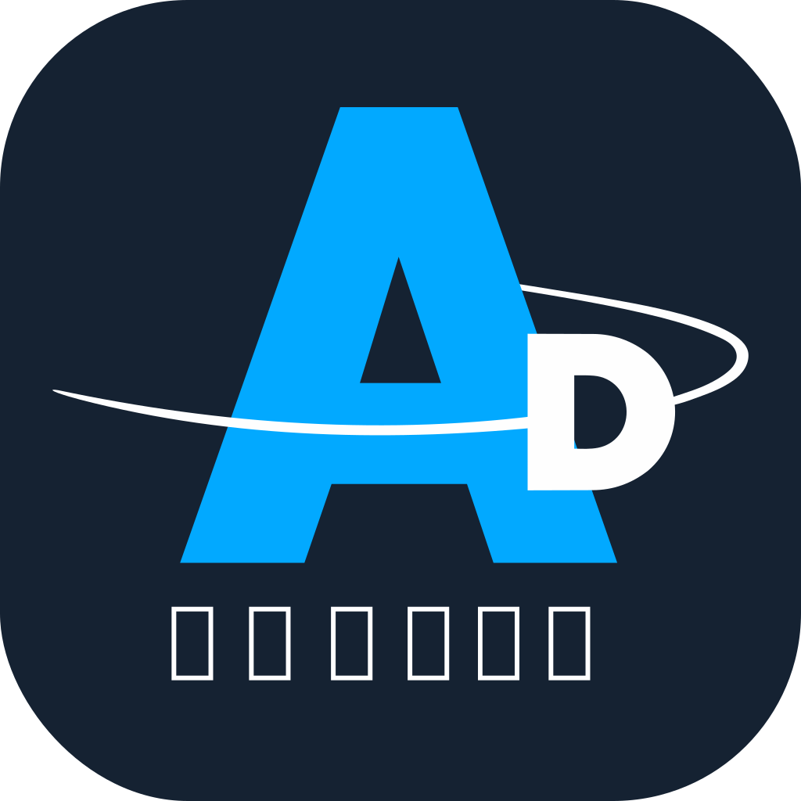

# 📱 AniDex

**A native SwiftUI mobile client for AniList - Discover, track, and share your favorite anime and manga on-the-go**

*AniDex is a third-party app and is not affiliated with AniList.*

[Features](#-features) • [Screenshots](#-screenshots) • [Download](#-download) • [Privacy](#-privacy) • [Support](#-support)

---

## ✨ Features

<table>
<tr>
  <th width="50%">

### 🎯 Core Features

  </th>
  <th width="50%">

### 🚀 Native Experience

  </th>
</tr>
<tr>
  <td width="50%" valign="top">

  - **Comprehensive AniList Integration** - Access your entire anime and manga library
  - **Update Your Lists** - Mark episodes watched, chapters read, and update scores
  - **Browse & Discover** - Explore trending, popular, and seasonal content
  - **Character & Staff Info** - Detailed information about your favorite characters and creators

  </td>
  <td width="50%" valign="top">

  - **Built with SwiftUI** - Modern, native iOS interface
  - **Multi-Platform** - Seamless across iPhone, iPad, Mac, Vision Pro, and Apple Watch
  - **Fast & Responsive** - Direct GraphQL API integration
  - **Apple Ecosystem** - Designed for iOS, iPadOS, macOS<!--, visionOS, and watchOS -->

  </td>
</tr>
</table>

---

## 📸 Screenshots

  

---

## 🎨 Why Choose This Client?

| | | |
|---|---|---|
| 📱 | **Native SwiftUI** | Built from ground up with modern Swift |
| 🌐 | **Full API Access** | Complete AniList GraphQL integration |
| ⚡ | **Fast & Fluid** | Optimized performance across all Apple devices |
| 🎨 | **Apple Design** | Follows Apple's Human Interface Guidelines |
| 🌙 | **Dark Mode** | Beautiful in light and dark themes |
| 📊 | **Rich Data** | All the information from AniList at your fingertips |

---

## 📥 Download

### Available on the App Store

**Requirements:** iOS 26.0+ | iPadOS 26.0+ | macOS 26.0+ | visionOS 26.0+ | watchOS 26.0+

**Note:** AniDex is an unofficial client. Not affiliated with or endorsed by AniList.

---

## 💡 How It Works

1. **Download & Install** - Get the app from the App Store
2. **Sign In with AniList** - Connect your existing AniList account
3. **Start Tracking** - Browse, update, and manage your anime and manga lists
4. **Sync Everywhere** - Changes sync instantly with AniList across all devices

---

## 🛡️ Privacy & Data

This app is a client interface for AniList:

- ✅ Connects directly to AniList's GraphQL API
- ✅ Your data is managed by AniList
- ✅ No additional data collection by this app
- ✅ Authentication handled securely through AniList OAuth
- ✅ All data storage and privacy policies follow AniList's terms

Read the app's [Privacy Policy](https://arvinshen.github.io/anidex-ios/PRIVACY.md) and [Terms & Conditions](https://arvinshen.github.io/anidex-ios/TERMS.md).

For further information, see [AniList's Privacy Policy](https://anilist.co/terms)

---

## 🆘 Support

Need help? We're here for you!

- 📧 Email: [anidex-ios@protonmail.com](mailto:anidex-ios@protonmail.com)<!-- - 🐦 Twitter: [@YourApp](https://twitter.com) --><!-- - 💬 FAQ: [Frequently Asked Questions](https://yourwebsite.com/faq) -->
- 🐛 Bug Reports: [GitHub Issues](https://github.com/arvinshen/anidex-ios/issues)

---

## 🗺️ Roadmap

**Coming Soon:**

- [ ] Anime & Manga list management tabs
- [ ] Settings modification
  - [ ] Profile
  - [ ] Account
  - [ ] Anime & Manga
  - [ ] Custom lists
- [ ] Profile tab updates
- [ ] Improve advanced search and filtering
- [ ] Improve social features
- [ ] New localizations
- [ ] Anime airing notifications
- [ ] Biometric support
- [ ] Add new animations & improve existing ones
- [ ] Accessibility support
- [ ] Custom app icons and themes
- [ ] Widget support for home screen
- [ ] iPad & Mac optimizations
- [ ] UI/UX updates for iPad and Mac
- [ ] Siri shortcuts integration
- [ ] Live Activities integration
- [ ] Apple Watch compatibility
- [ ] Apple Vision Pro compatibility
- [ ] Multiple accounts support and easy switching between accounts
- [ ] More customization options
- [ ] Reduce App Size

---

## 📱 System Requirements

- **iOS:** 26.0 or later
- **iPadOS:** 26.0 or later
- **macOS:** 26.0 or later
<!-- - **visionOS:** 26.0 or later
- **watchOS:** 26.0 or later -->
- **AniList Account:** Required for tracking and managing your anime and manga lists (free at [anilist.co](https://anilist.co))

---

## 📄 License

Copyright © 2025 Arvin Shen. All rights reserved.

This is an unofficial, third-party client for AniList. Not affiliated with or endorsed by AniList.

---

**Made with ❤️ for AniList users**

[AniList](https://anilist.co) • [AniList API](https://anilist.gitbook.io/anilist-apiv2-docs)

*AniDex is a third-party app and is not affiliated with AniList.*

